<p align="center">
  
</p>

<p align="center">
  A native Jellyfin player made for the Facebook Portal.
</p>

<p align="center">
  <strong>v2.0 — a ground-up native rebuild.</strong> The browsing experience is now
  native Jetpack Compose talking to the Jellyfin REST API directly, instead of a
  styled WebView — noticeably snappier on the Portal's modest hardware.
</p>

<p align="center">
  <a href="https://www.youtube.com/watch?v=1E4ZBgMRJXY" target="_blank" rel="noopener noreferrer">
    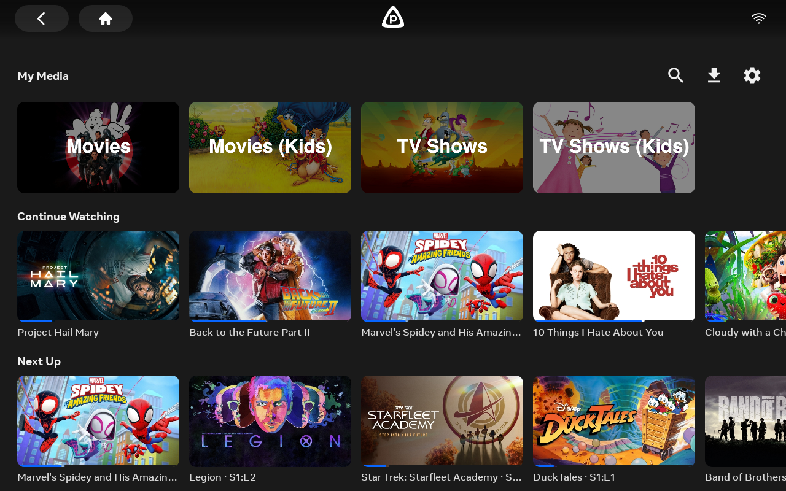
  </a>
</p>

<p align="center">
  ▶︎ <a href="https://www.youtube.com/watch?v=1E4ZBgMRJXY" target="_blank" rel="noopener noreferrer"><strong>See it in action on the Portal</strong></a>
</p>

<p align="center">
  <a href="https://github.com/luke-hurd/portalfin/releases/latest/download/portalfin.apk"></a>
</p>

<p align="center">
  <a href="https://github.com/luke-hurd/portalfin/releases/latest/download/portalfin.apk"><strong>⬇ Download portalfin.apk</strong></a> &nbsp;·&nbsp; <a href="#sideload-instructions">Sideload instructions</a>
</p>

## What is portalfin?

portalfin is a Jellyfin client for the Facebook Portal. I had an old first-gen Portal
sitting around and wanted to use it as a Jellyfin player, so I forked the official
[Jellyfin Android app](https://github.com/jellyfin/jellyfin-android) and reworked it
to run well on the device.

The Portal is an Android device, so the standard Jellyfin APK installs and runs, but
it just isn't built for the device: it's a phone app on a 1280x800 always-on display,
the system back/home buttons float over the top of the UI, and there's a lot of
chrome you don't need when the device only ever does one thing.

**v1.x** got there by wrapping the Jellyfin web UI in a native shell and restyling
it with injected CSS. It looked the part, but jellyfin-web is a heavy React SPA and
the Portal's hardware felt every bit of it — scrolling hitched and pages were slow
to settle.

**v2.0** rebuilds the core experience as **native Jetpack Compose** screens that call
the Jellyfin REST API directly (via the Jellyfin Kotlin SDK). Home, library, detail,
TV/season browsing, search, sign-in, and the profile/settings screen are all native
now and built to Meta's Portal design system (Material 3 + the Inter typeface + Meta
blue `#0866FF` + 52dp touch targets). It is *much* snappier than the WebView versions.
The WebView still ships as a flag-gated fallback for anything not yet ported (person
pages, the admin dashboard), so nothing is lost.

## Screenshots

| On the Portal | Splash |
|---|---|
| 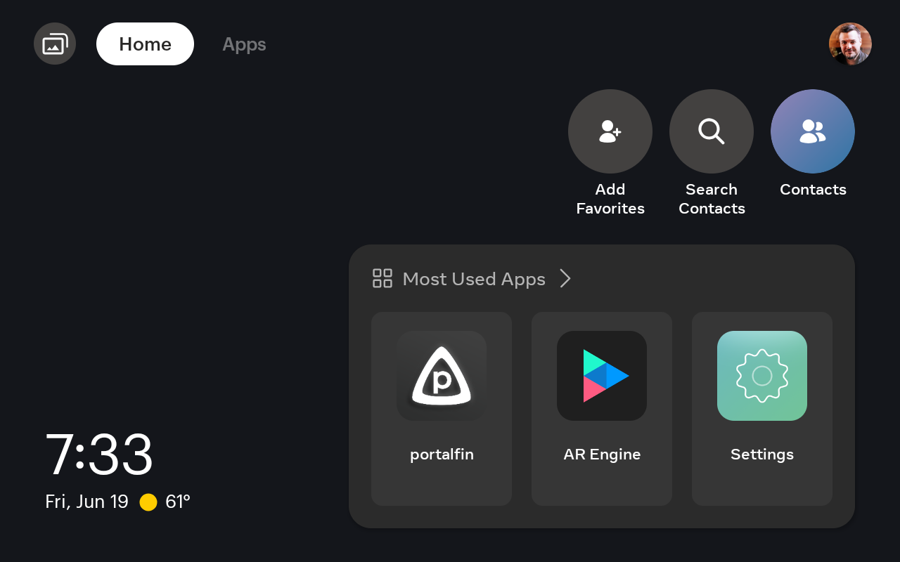 | 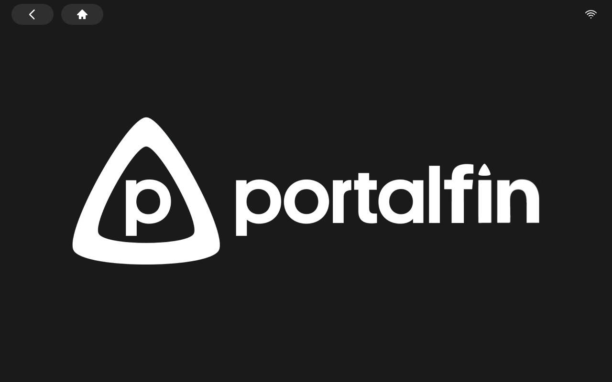 |

| Home | Library grid |
|---|---|
|  | 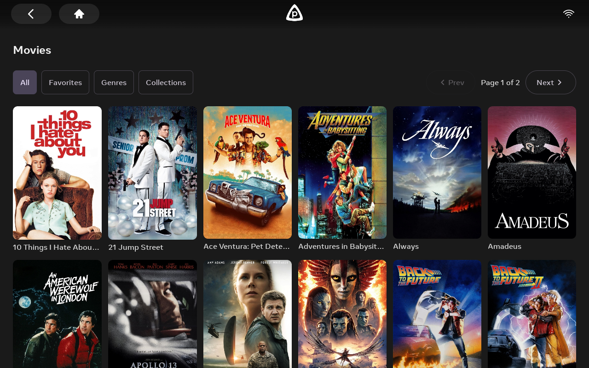 |

| Search | Movie detail |
|---|---|
| 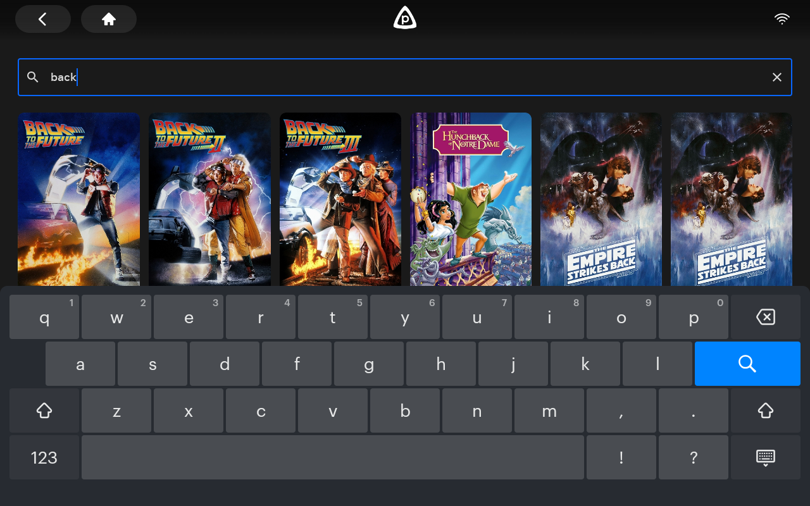 | 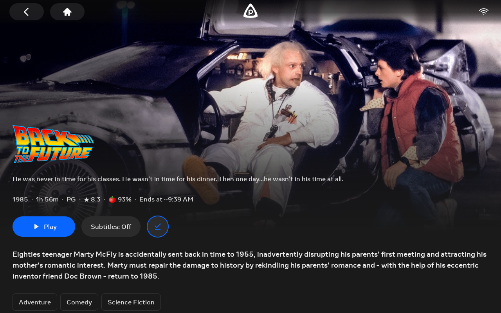 |

| Series detail | Season detail |
|---|---|
| 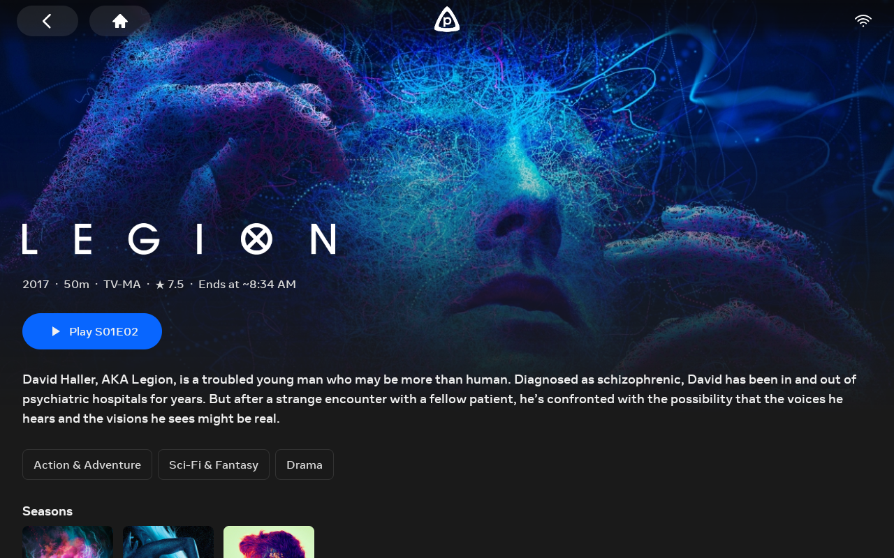 | 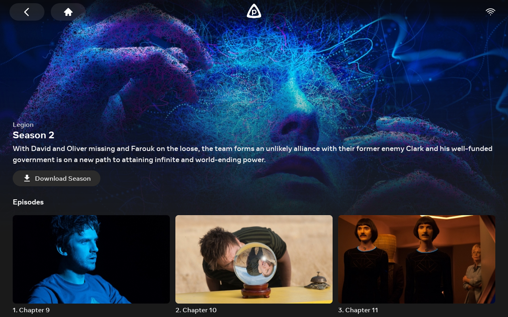 |

| Downloads | Connect to server |
|---|---|
| 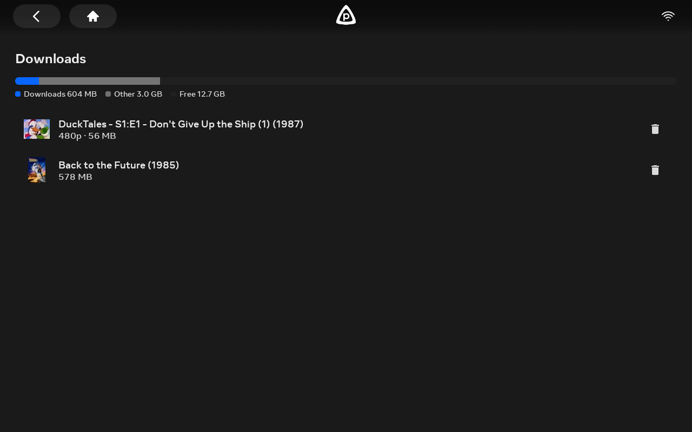 | 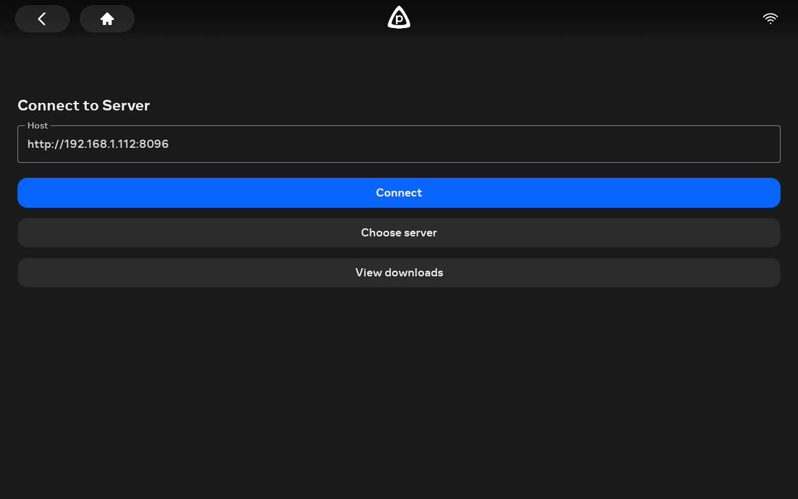 |

| Profile / settings | Sign in |
|---|---|
| 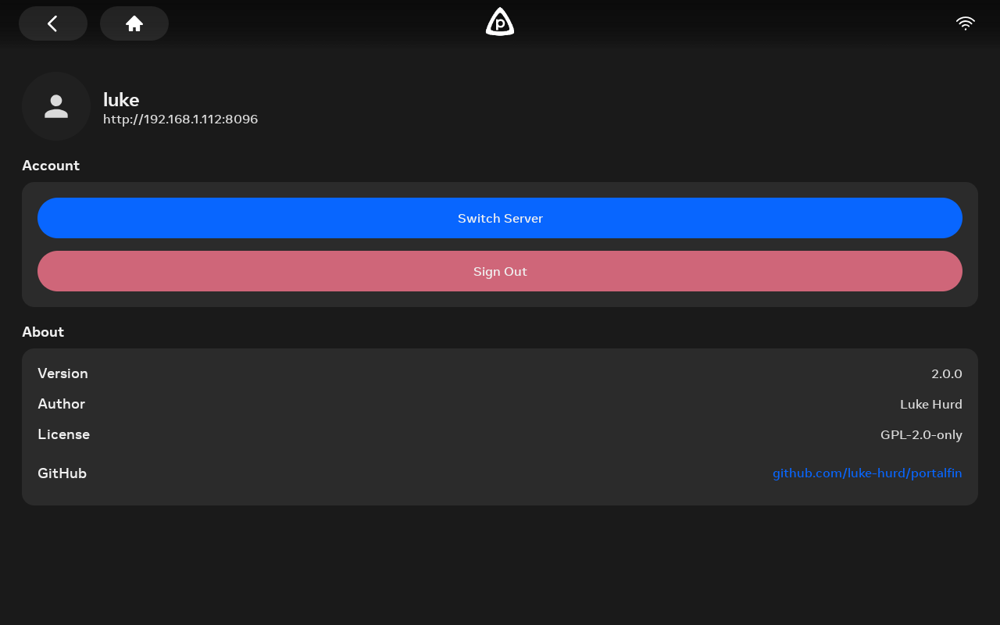 | 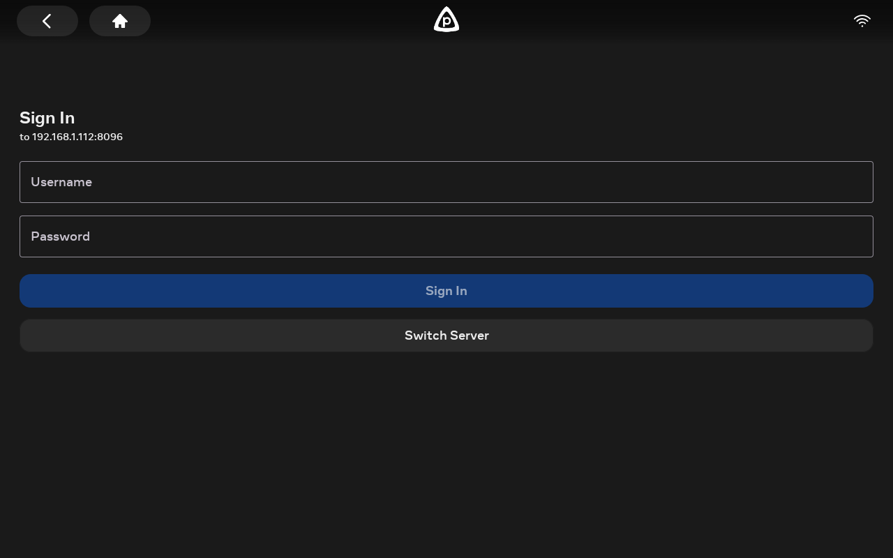 |

| Ambient screensaver | Ambient screensaver |
|---|---|
| 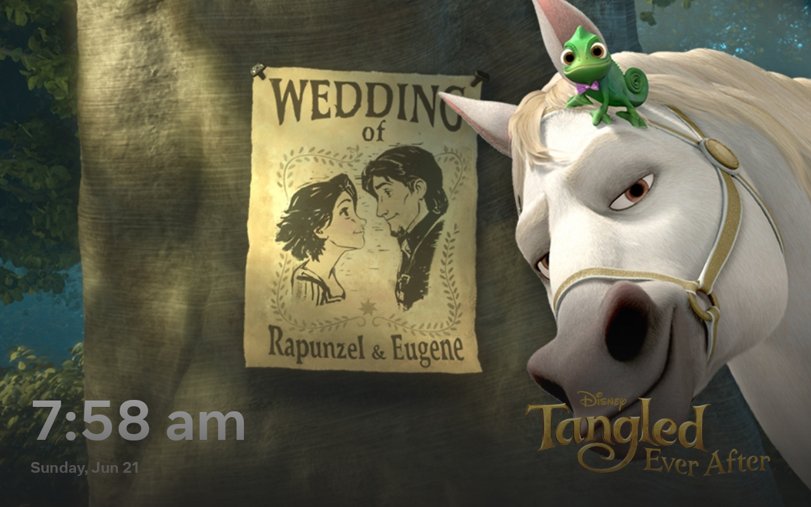 | 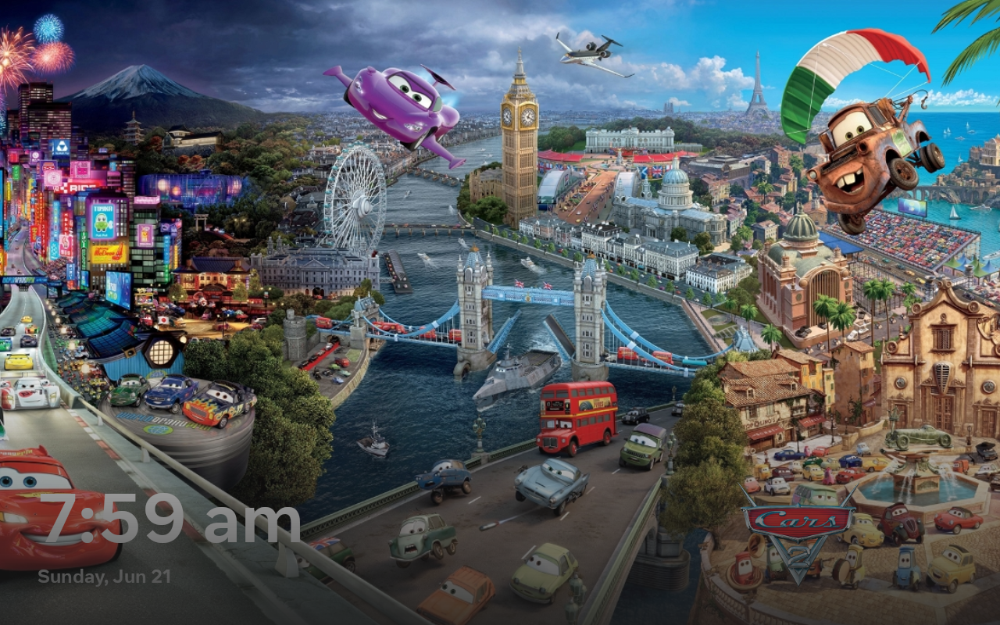 |

## What's native in v2.0

The whole browsing experience is native Compose, built to Meta's portal-samples
design system (Material 3, Inter, Meta blue, 52dp touch targets, dark-always):

- **Home grid** — My Media (your libraries), Continue Watching, Next Up, and New
  Releases per library, as smooth side-scrolling rails with lazy-loaded, panel-sized
  thumbnails. A static portalfin header floats above and content scrolls behind it.
  Search, Downloads and Settings sit as right-aligned icons on the "My Media" title row.
- **Search** — a native search screen backed by the REST API's server-side fuzzy
  match (the same one jellyfin-web uses), debounced as you type, with results in the
  same poster grid as the libraries. No WebView.
- **Library / category pages** — real pagination (100 per page, Prev / "Page X of Y"
  / Next at top and bottom), quick-filter pills (All · Favorites · Genres ·
  Collections), and Genres/Collections as titled poster grids.
- **Movie detail** — a fullscreen backdrop that fades into the page with content
  layered on top, graphical title art, Play / Resume / Start Over, cast & crew,
  scenes (chapter picker), More Like This, genre chips, Rotten Tomatoes critic
  score, community ★, an "Ends at" estimate, and a subtitle picker.
- **TV shows** — series pages with "Resume SxxExx / Play S01E01" plus a seasons row;
  full season detail pages with an episode grid and a season selector; and episode
  detail pages with the episode still over the series backdrop.
- **Native sign-in** — server entry and login call the Jellyfin SDK directly,
  instead of dropping you into a web login page.
- **Profile / settings** — a native screen (no WebView): your account, server, the
  native-home toggle, sign out, and switch server.
- **Native video player** — ExoPlayer with Portal-tuned controls: oversized
  play/skip/scrubber for at-distance touch, immersive fullscreen that survives the
  Portal's system-OSD band, and the noise (fullscreen/lock/decoder/info) removed.
- **Ambient screensaver** — after ~60s idle, a fullscreen slideshow of random
  cover art from your library with a slow Ken Burns zoom & drift, big clock + date,
  and the title's logo art. Backdrops crossfade on top of one another (never a gap),
  the Portal's system-OSD band is hidden for a true edge-to-edge display, and any
  touch dismisses it. It never engages while a video is playing or the app is
  backgrounded.
- **Transcoded downloads** — download any movie/episode (or a whole season) at a
  chosen quality (1080p / 720p / 480p); the server transcodes to a phone-sized file
  instead of the multi-GB original. A round download button on the detail page shows
  download / in-progress / downloaded states; the Downloads screen shows each item's
  quality + size and an iOS-style device-storage bar; season downloads check free
  space first and suggest a lower quality if it won't fit. Downloaded copies play
  offline (and scrub) — Play/Resume uses the local file automatically.

Carried over from v1.x: animated screen transitions, a branded splash, and the
layout that reserves the Portal's top system-button band. (The ambient slideshow
was a v1.x web feature too — in v2.1 it's been rebuilt fully native; see above.)

### How it works under the hood

`MainActivity` runs a small state machine over server and user state: no server
configured routes to a native `ConnectFragment`, a server but no user routes to a
native `LoginFragment`, and once you're authenticated it lands on the native home
grid (`HomeFragment`) — or, with the native-home flag off, the legacy
`WebViewFragment` that hosts jellyfin-web.

The native screens talk to the server through the **Jellyfin Kotlin SDK** (itemsApi,
tvShowsApi, userLibraryApi, imageApi, etc.) and render with Compose + Coil, with
image decodes pinned to each card's pixel size so scrolling stays smooth on the
Portal. Search uses the same `itemsApi.getItems(searchTerm = …)` call as the library
grid, so results are full items that open the native detail screen. Navigation is a
fragment state machine with custom crossfade transitions, and the portalfin header is
an Activity-level overlay so it stays put while fragments animate beneath it.

The **WebView path still exists** as a flag-gated fallback for the few screens not yet
ported (person pages, the admin dashboard). There it injects `portalfin-restyle.js` on
every page load (and re-injects on SPA navigation) to reserve the 64px top band, swap
in the custom header, hide the kiosk chrome, and apply the Portal palette — the same
approach v1.x used everywhere.

## Supported devices

- **Portal Gen 1** ("aloha") — confirmed working
- Portal Gen 2 / Mini / Plus / Go / TV — likely work but untested. See [meta-quest/portal-samples](https://github.com/meta-quest/portal-samples) for the official supported device list.

Requirements:
- Portal firmware from October 2025 or later
- ADB enabled in **Settings → Debug → ADB Enabled**

## Sideload instructions

The Portal has no app store, so you install over USB with ADB. ADB was locked on
the Portal until October 2025, when a Meta firmware update enabled it, so first make
sure your Portal is up to date. After that it's a one-time setup:

1. Install Android platform-tools: `brew install android-platform-tools` (macOS) or grab from [Google](https://developer.android.com/studio/releases/platform-tools)
2. Plug your Portal in via USB-C
3. Enable ADB on the Portal: Settings → Debug → ADB Enabled (you'll be prompted for the device password)
4. Accept the "Allow USB debugging?" dialog on the Portal screen
5. Verify the connection: `adb devices` should show your Portal
6. Download the APK — this link always points at the newest release:
   **[⬇ portalfin.apk](https://github.com/luke-hurd/portalfin/releases/latest/download/portalfin.apk)**
7. Install: `adb install portalfin.apk`

> The download link never changes between versions, so other projects can link
> to it directly. Want a specific version instead? Grab it from the
> [releases page](https://github.com/luke-hurd/portalfin/releases).

The portalfin tile will appear on the Portal's Apps screen.

## Building from source

Requirements: JDK 17, Android SDK with platform-36 + build-tools 36.0.0.

```bash
git clone https://github.com/luke-hurd/portalfin.git
cd portalfin
./gradlew :app:assembleProprietaryDebug
adb install -r app/build/outputs/apk/proprietary/debug/portalfin.apk
```

## Roadmap

Shipped:

- [x] **Native UI rebuild (v2.0)** — native Jetpack Compose home, library, and
  detail screens calling the Jellyfin REST API directly, on Meta's Portal design
  system (Material 3 + Inter + Meta blue). See [v2.0.0 release notes](docs/releases/v2.0.0.md).
- [x] **Native Portal home grid** — My Media + Continue Watching + Next Up + New
  Releases rails, replacing jellyfin-web's React home.
- [x] **Native library pages** — pagination, quick-filter pills (All / Favorites /
  Genres / Collections), grouped genre & collection grids.
- [x] **Native detail page** — fullscreen backdrop, title art, Play/Resume,
  cast & crew, scenes (chapters), more-like-this, RT score, subtitle picker.
- [x] **Native TV / season / episode flow** — series pages (Resume SxxExx +
  seasons row), season detail with an episode grid, episode detail pages.
- [x] **Native search** — REST API server-side fuzzy match, debounced, results
  in the library poster grid, opening native detail (no WebView).
- [x] **Native profile / settings** — account, server, native-home toggle,
  sign out, switch server (no WebView).
- [x] **M3 auth flow** — Connect / server selection / Login migrated to
  Material 3 with the Portal header and top-inset reserve.
- [x] **Transcoded downloads** — pick 1080p/720p/480p; server transcodes to a
  phone-sized file; offline playback + scrubbing (MPEG-TS), per-item quality,
  device-storage bar, whole-season downloads with free-space checks.
- [x] **Portal-tuned native player** — oversized controls/scrubber, immersive
  fullscreen that survives the system-OSD band, trimmed control set.
- [x] **Native ambient screensaver (v2.1)** — fullscreen idle slideshow rebuilt
  in Compose: Ken Burns zoom/drift, clock + date, title art, gap-free layered
  crossfade, hidden OSD band. See [v2.1.0 release notes](docs/releases/v2.1.0.md).
- [x] **CSS view transitions** between SPA routes (v1.1)
- [x] **Native splash → home crossfade** (v1.1)
- [x] **Ambient slideshow** — 60s-idle fullscreen backdrop gallery with clock/date (v1.1)
- [x] **Custom video player chrome** — minimal back/title/cast bar, black letterbox (v1.1)

Next up — contributions welcome:

- [ ] **Native person/actor pages** — the main remaining WebView screen.
- [ ] **Genre chips that dive into the genre** from the detail page.
- [ ] **Weather overlay** on the ambient slideshow (clock + date are done; weather is not)
- [ ] **Voice control** via the Portal's built-in mic ("portalfin, play Back to the Future")

## Architecture

The interesting bits:

```
app/src/main/java/org/jellyfin/mobile/
├── MainActivity.kt              # Server/User state machine drives Fragment routing:
│                                #   ServerState.Unset                          → ConnectFragment
│                                #   ServerState.Available + UserState.Unset     → LoginFragment
│                                #   ServerState.Available + UserState.Available → HomeFragment (native)
│                                #                                                 or WebViewFragment (flag off)
│                                # Also hosts the static portalfin header overlay + openDetail/openSeason/…
├── ui/
│   ├── utils/AppTheme.kt        # M3 theme: PortalDarkColorScheme (Meta blue), Inter typography, PortalColors
│   └── screens/                 # All native Compose, on the Portal design system:
│       ├── home/                # HomeScreen — My Media / Continue Watching / Next Up / New Releases rails
│       ├── library/             # LibraryScreen + paged/grouped ViewModels (pagination, filter pills)
│       ├── detail/              # DetailScreen — movie/series/episode hero + actions + rows
│       ├── season/              # SeasonScreen — season detail page (episode grid + season selector)
│       ├── search/              # SearchScreen + SearchViewModel — REST API fuzzy search (debounced)
│       ├── profile/             # ProfileScreen — native settings (no WebView)
│       ├── connect/ + login/    # ConnectScreen / ServerSelection / LoginScreen (M3; SDK authenticateUserByName)
│       └── PortalHeader.kt      # Static header overlay (HEADER_HEIGHT = 64dp top reserve)
├── player/ui/                   # Native ExoPlayer: PlayerFragment, PlayerMenus, PlayerFullscreenHelper
└── webapp/
    ├── WebViewFragment.kt       # Flag-gated fallback for un-ported screens (person pages, dashboard).
    │                            #   PortalFinBridge: getCredentials() seeds jellyfin-web localStorage,
    │                            #   onSignedOut() clears the native session, onRestyleApplied() fades in.
    └── JellyfinWebViewClient.kt # In onPageFinished: re-injects portalfin-restyle.js on every nav

app/src/main/assets/native/
└── portalfin-restyle.js         # WebView-path stylesheet: reserves the 64px top band, custom header,
                                 # kiosk-chrome hiding, ambient slideshow, SPA-route re-injection.

app/src/main/res/
├── values/colors.xml                # Portal palette: #1A1A1A / #2B2B2B / #0866FF
└── values/dimens.xml                # Portal-tuned player control sizes
```

## Attribution

Forked from [jellyfin/jellyfin-android](https://github.com/jellyfin/jellyfin-android),
which is licensed [GPL-2.0-only](LICENSE.md). All upstream work belongs to its
authors. The portalfin-specific changes are copyright Luke Hurd, also under
GPL-2.0.

Portal hardware, the Aloha framework, and Meta's Portal SDK belong to Meta
Platforms, Inc. portalfin is not affiliated with or endorsed by Meta.

## License

GPL-2.0-only. See [LICENSE.md](LICENSE.md).
