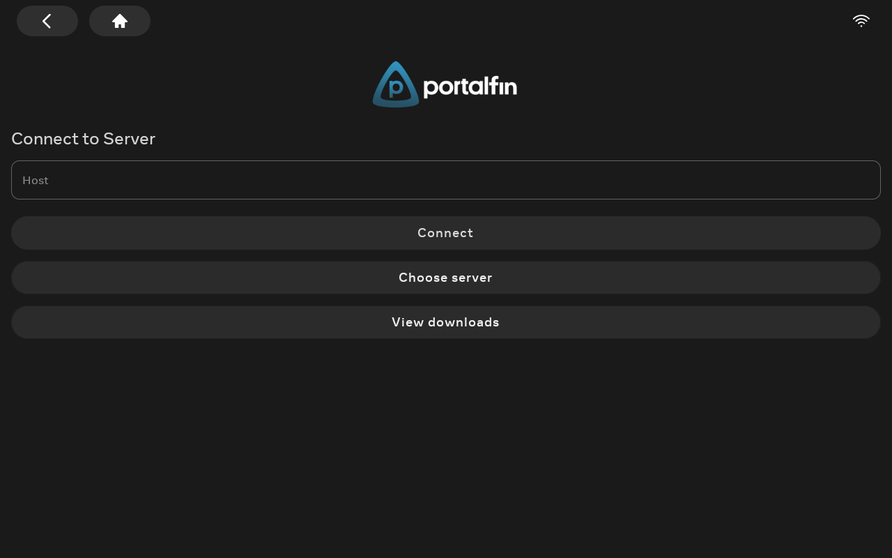
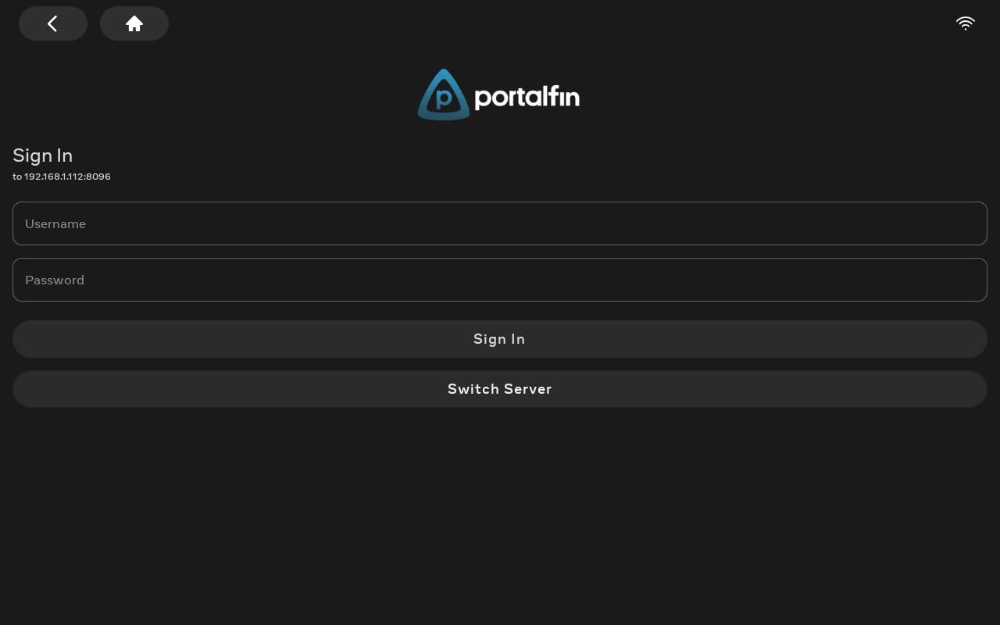
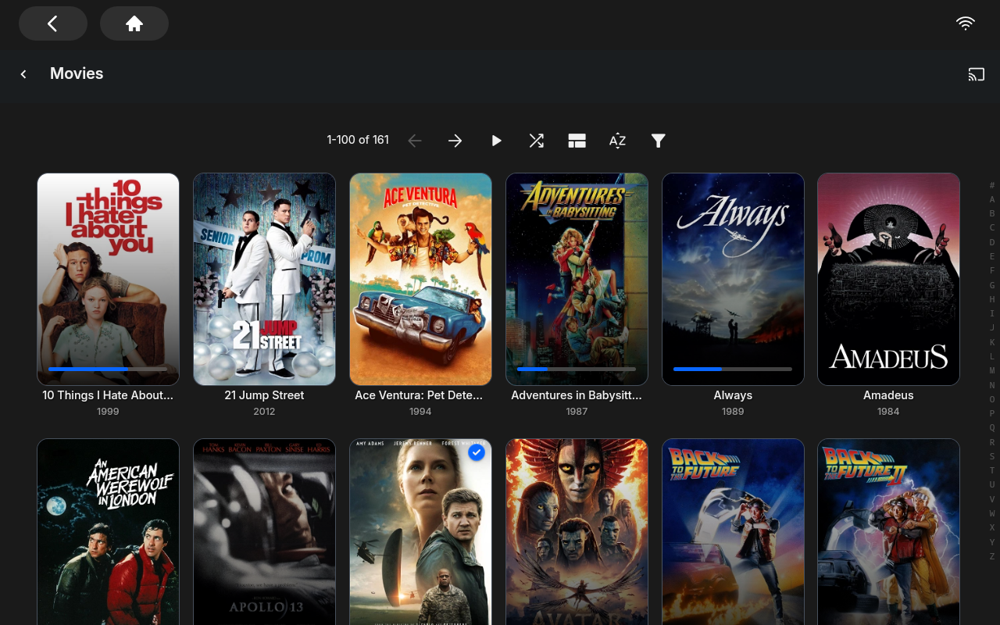
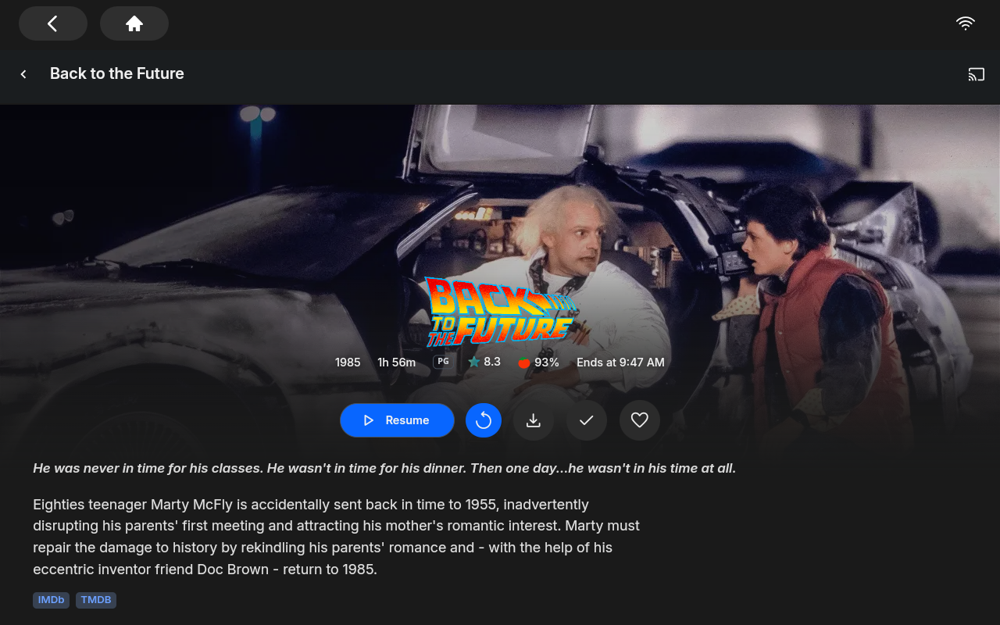
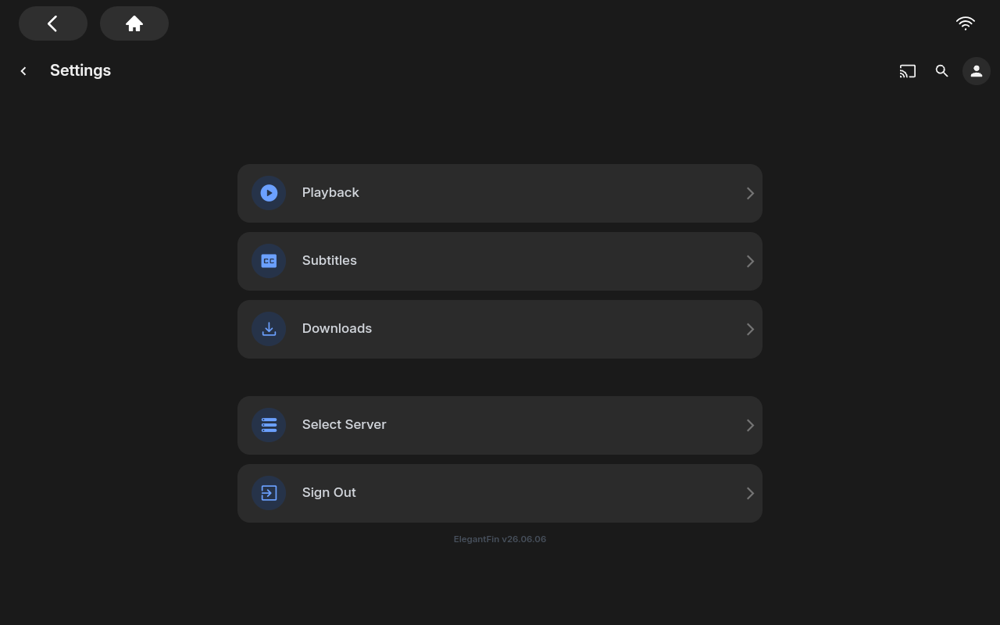
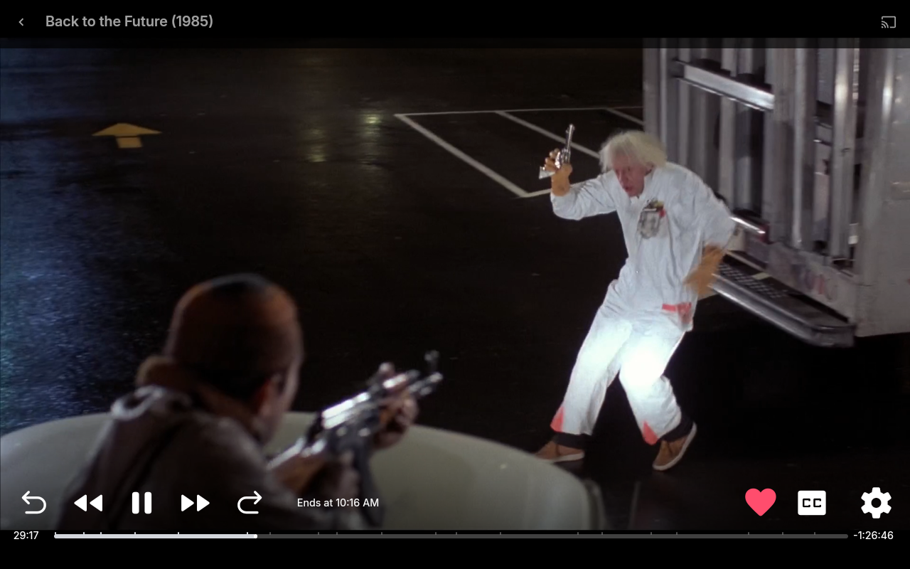
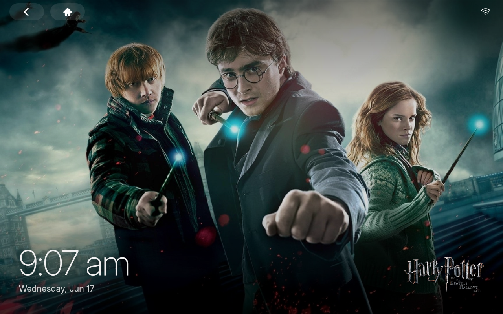
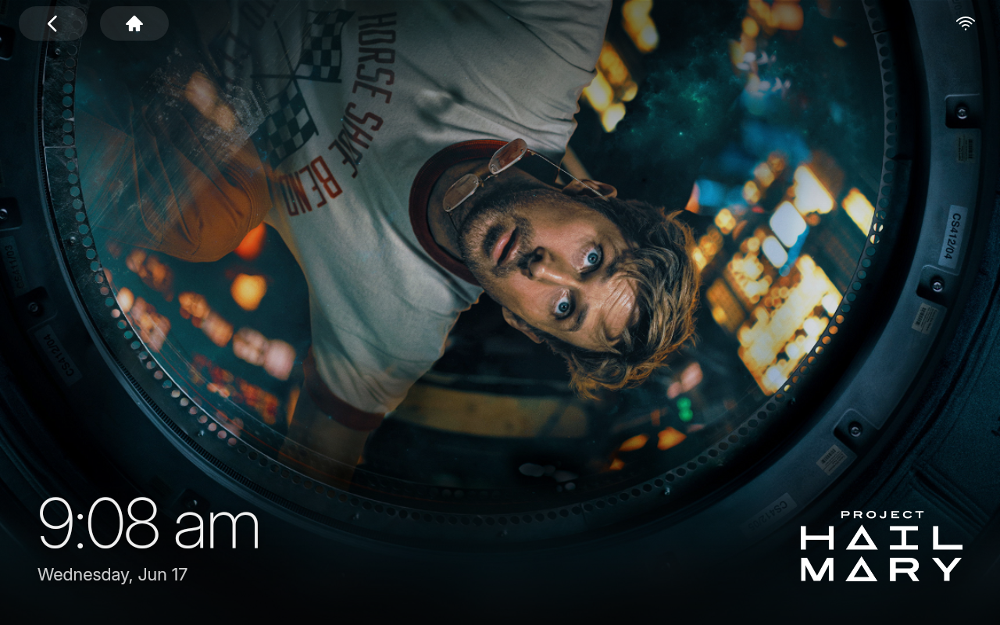

<p align="center">
  
</p>

<p align="center">
  A Jellyfin client built specifically for the <strong>Facebook Portal</strong> family of devices.<br/>
  Forked from <a href="https://github.com/jellyfin/jellyfin-android">jellyfin/jellyfin-android</a>, re-skinned and re-shelled around Portal's hardware quirks.
</p>

<p align="center">
  
</p>

## What this is

The original Facebook Portal (codename **aloha**) shipped with ADB locked. In
October 2025, Meta enabled ADB on a firmware update, opening the device up for
sideloaded apps for the first time. portalfin is a pragmatic Jellyfin client
that takes advantage of that — a **native portalfin shell** wrapping the
mature jellyfin-web UI, with a real Compose login flow, kiosk-only navigation
(no admin dashboard), and a custom header that respects Portal's reserved
top overlay.

## Screenshots

| Connect to server | Native sign-in |
|---|---|
|  |  |

| Home | Library |
|---|---|
|  |  |

| Movie detail | Profile / settings |
|---|---|
|  |  |

| Video player | |
|---|---|
|  | |

| Ambient slideshow | Ambient slideshow |
|---|---|
|  |  |

## Why a fork (and what's different from upstream)

| Concern | Upstream behavior | portalfin |
|---|---|---|
| Sign-in | Web client login inside the WebView | **Native Compose `LoginScreen`** that calls the Jellyfin SDK directly, then seeds the WebView's `localStorage` so it lands authenticated on `/home` |
| Top inset | None | Portal's white system overlay (back/home/wifi) reserves y=0..64; the WebView area starts below it. portalfin's header sits flush at the top of the WebView. |
| Header chrome | Default jellyfin-web header — drawer, group, sync play, admin shortcuts | Custom 51px `#portalfin-header` with wordmark + cast/search/profile only. Hamburger drawer hidden, admin routes redirect home. |
| Logo / branding | Jellyfin teal `#00a4dc` everywhere | portalfin "p" mark + wordmark, Meta blue `#0866FF` accents matching Portal's design language |
| Battery-optim snackbar | "Please disable battery optimizations…" prompt | Suppressed on Portal (`Build.DEVICE == "aloha"`) — Portal doesn't expose battery optimization settings anyway |
| Sign-out lifecycle | jellyfin-web logs out, you stay in WebView staring at its login | JS detects logout and clears native `UserEntity`, routing back to portalfin's native `LoginFragment` |
| Restyle | None | `portalfin-restyle.js` is injected on every page — global Portal palette, button shape, Inter font fallback, kiosk chrome hiding, in-session route re-application |
| Default host | Empty | Empty (the previous v0 builds shipped a hard-coded LAN address — removed in v1.0.0) |
| SPA route transitions | Hard snap between routes | Native [View Transitions API](https://developer.mozilla.org/docs/Web/API/View_Transitions_API): home → library → detail navigations crossfade in 180ms with an ease-out curve. The portalfin header gets a `view-transition-name` so it stays put across routes. ([feature/view-transitions](https://github.com/luke-hurd/portalfin/tree/feature/view-transitions)) |
| Cold-launch transition | OS splash hard-cuts to the activity, then loading container hard-cuts to the WebView | OS splash icon fades + scales (`installSplashScreen().setOnExitAnimationListener`); the loading-container wordmark animates up + scales down while the WebView crossfades in (240ms). ([feature/splash-crossfade](https://github.com/luke-hurd/portalfin/tree/feature/splash-crossfade)) |
| Idle behavior | Portal dims and goes to its own screensaver | Ambient slideshow at 60s idle: rotating fullscreen Jellyfin backdrop art, oversized clock + date, current item title. Acquires `FLAG_KEEP_SCREEN_ON` so Portal doesn't dim mid-show. Tap to dismiss. ([feature/ambient-mode](https://github.com/luke-hurd/portalfin/tree/feature/ambient-mode)) |
| Background tint | Flat #1A1A1A all the time | Time-of-day theme: cool morning, neutral day, warm evening, deep night. Shifts the page background tint live (8s ease) so the device feels alive. ([feature/polish-pass](https://github.com/luke-hurd/portalfin/tree/feature/polish-pass)) |

## Supported devices

- **Portal Gen 1** ("aloha") — confirmed working
- Portal Gen 2 / Mini / Plus / Go / TV — likely work but untested. See [meta-quest/portal-samples](https://github.com/meta-quest/portal-samples) for the official supported device list.

Requirements:
- Portal firmware from October 2025 or later
- ADB enabled in **Settings → Debug → ADB Enabled**

## Sideload instructions

Portal has no app store. You install via ADB.

1. Install Android platform-tools: `brew install android-platform-tools` (macOS) or grab from [Google](https://developer.android.com/studio/releases/platform-tools)
2. Plug your Portal in via USB-C
3. Enable ADB on the Portal: Settings → Debug → ADB Enabled (you'll be prompted for the device password)
4. Accept the "Allow USB debugging?" dialog on the Portal screen
5. Verify the connection: `adb devices` should show your Portal
6. Download `portalfin-vX.Y.Z.apk` from the [latest release](https://github.com/luke-hurd/portalfin/releases/latest)
7. Install: `adb install portalfin-vX.Y.Z.apk`

The portalfin tile will appear on the Portal's Apps screen.

## Building from source

Requirements: JDK 17, Android SDK with platform-36 + build-tools 36.0.0.

```bash
git clone https://github.com/luke-hurd/portalfin.git
cd portalfin
./gradlew :app:assembleProprietaryDebug
adb install -r app/build/outputs/apk/proprietary/debug/portalfin-v*-proprietary-debug.apk
```

## Roadmap

Shipped:

- [x] **CSS view transitions** between SPA routes — kill the flat web-app feel on every navigation
- [x] **Native splash → home crossfade** — splash logo crossfades into the styled web app
- [x] **Ambient slideshow** — after 60s idle, fullscreen rotating gallery of Jellyfin backdrop art with oversized clock + date + current item title; tap to wake. Fills the screen edge-to-edge (drops the Portal top inset) and keeps the display awake.
- [x] **Custom video player chrome** — minimal back/title/cast top bar, black letterbox, enlarged transport controls, all auto-hiding with the OSD

Next up — contributions welcome:

- [ ] **Weather overlay** on the ambient slideshow (clock + date are done; weather is not)
- [ ] **Transcode-on-download quality picker** (in progress) — pick 1080p/720p and transcode server-side to a phone-sized MP4 instead of the multi-GB remux
- [ ] **Native Portal home grid** — replace jellyfin-web's React home with native Compose tiles calling the Jellyfin REST API directly. Biggest lift, biggest payoff for "feels native."
- [ ] **Haptic accents** on tile taps and detail-page actions
- [ ] **Voice control** via the Portal's built-in mic ("portalfin, play Back to the Future")
- [ ] **Per-user home pages** using the existing Aloha account framework (4 internal user accounts already exist on every Portal)

## Architecture

The interesting bits:

```
app/src/main/java/org/jellyfin/mobile/
├── MainActivity.kt              # Server/User state machine drives Fragment routing:
│                                #   ServerState.Unset       → ConnectFragment
│                                #   ServerState.Available + UserState.Unset → LoginFragment
│                                #   ServerState.Available + UserState.Available → WebViewFragment
├── setup/
│   ├── ConnectFragment.kt       # Native server URL entry (Compose)
│   └── LoginFragment.kt         # Native sign-in (Compose) — NEW IN PORTALFIN
├── ui/screens/
│   ├── connect/ConnectScreen.kt # Compose UI for server entry; defines reusable StyledTextButton
│   └── login/LoginScreen.kt     # Compose UI calling Jellyfin SDK's authenticateUserByName
└── webapp/
    ├── WebViewFragment.kt       # Hosts the WebView. Inner class PortalFinBridge exposes
    │                            #   getCredentials() → seed jellyfin-web localStorage
    │                            #   onSignedOut()    → clear native UserEntity + route to Login
    │                            #   onRestyleApplied() → fadeIn the WebView once styled
    └── JellyfinWebViewClient.kt # In onPageFinished: re-injects portalfin-restyle.js on every nav

app/src/main/assets/native/
├── portalfin-restyle.js         # The big one. Visibility gate, full Portal stylesheet,
│                                # custom #portalfin-header, kiosk chrome hiding, sign-out
│                                # detection, SPA-route re-injection.
└── wordmark.png                 # Served at /native/wordmark.png by AssetsPathHandler

app/src/main/res/
├── drawable/ic_launcher_padded.xml  # Launcher icon (Portal launcher does its own crop;
│                                    # adaptive icon XML files removed — use this instead)
├── values/colors.xml                # Portal palette: #1A1A1A / #2B2B2B / #0866FF
└── values/strings_donottranslate.xml # app_name = "portalfin"
```

## Attribution

Forked from [jellyfin/jellyfin-android](https://github.com/jellyfin/jellyfin-android),
which is licensed [GPL-2.0-only](LICENSE.md). All upstream work belongs to its
authors. The portalfin-specific changes are copyright Luke Hurd, also under
GPL-2.0.

Portal hardware, the Aloha framework, and Meta's Portal SDK belong to Meta
Platforms, Inc. portalfin is not affiliated with or endorsed by Meta.

## License

GPL-2.0-only. See [LICENSE.md](LICENSE.md).
